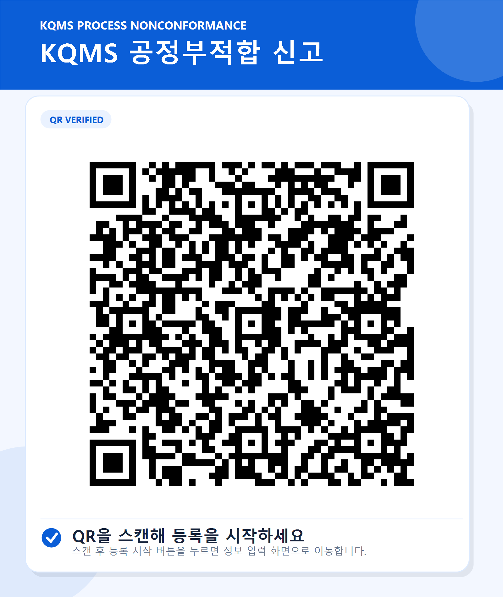

# KQMS 공정부적합 신고 · 공개 테스트

QR 스캔으로 시작하는 모바일 공정부적합 신고 Form의 공개 사용자 흐름 테스트입니다.

공개 테스트 사이트: https://sy-1190.github.io/KQMS-QR-Scrap-Form/

## 공개 테스트 범위

- 어느 위치에서나 동일한 Form을 여는 QR 링크 진입
- 발생일 우선 입력과 작성자·작성 팀/부서 필수 입력
- KHMDS에서 동기화된 실제 발생 공정 목록 조회 및 직접 선택
- KHMDS 부서·협력업체를 합친 실제 작성 팀/부서 목록 조회 및 선택
- KHMDS 실제 품번 또는 모델 앞부분 검색과 검색 실패 시 수기작성
- 검색 팝업에서 여러 품번 선택 후 모델·고객사 자동입력
- 수기 품번의 모델·고객사 선택입력
- 여러 품번 추가 및 품번별 호기·EA 수량 입력
- 자진신고 또는 보물찾기 선택
- 수정 또는 폐기 처리 구분 선택
- 수정 선택 시 이동 기준 설명 표시
- 폐기 선택 시 처리 구분 바로 아래에서 적치 장소와 KHMDS 실제 공정 진행 사항 복수 선택
- 실제 폐기품 적치 위치 선택 시 해당 위치 사진 표시
- 공정부적합 기본정보 입력
- 스마트폰 카메라 촬영 또는 사진 선택
- 입력 내용 최종 확인
- 암호화된 전송 대기열과 KQMS 접수 상태 화면
- 전송 대기·접수 중·자동 재시도·완료·실패 표시와 실패 건 다시 전송
- KQMS 접수 완료 후 카카오톡 채팅방 공유를 최우선 행동으로 안내
- 접수 핵심정보 텍스트 공유와 공유 문구 복사 대체 기능

이 공개 버전은 화면과 입력 흐름 및 KQMS 접수 상태 확인을 위한 테스트본입니다.

- 입력값은 비공개 운영 백엔드에서 형식과 KHMDS 기준정보를 확인한 뒤 암호화된 대기열을 거쳐 KQMS에 전달합니다.
- 일시 장애는 제한된 횟수만 자동 재시도하며 최종 실패 시 접수자가 다시 전송할 수 있습니다.
- KQMS 접수 성공 시 암호화된 제출 본문은 즉시 삭제하고 접수 확인 메타데이터만 보관합니다.
- 선택한 사진은 암호화된 임시 저장소를 거쳐 KQMS에 전달되며 KQMS 저장 성공 후 임시 사진은 삭제됩니다.
- 카카오톡 공유문에는 사진, 비밀 확인키와 내부 API 정보가 포함되지 않습니다.
- 내부 KHMDS·KQMS 주소, 인증정보와 실제 저장 계약은 포함하지 않습니다.

## QR 사용 방법

아래 QR을 PC나 태블릿에 표시한 뒤 스마트폰 기본 카메라로 스캔합니다.



QR을 스캔해 접속하면 `등록 시작` 버튼이 표시되며, 버튼을 누르면 정보 입력 화면으로 이동합니다. QR에는 아래 공개 Form 주소가 포함되어 있습니다.

```text
https://sy-1190.github.io/KQMS-QR-Scrap-Form/?qr=QR-KQMS-PROCESS-NONCONFORMANCE
```

공개 QR은 특정 공정을 고정하지 않습니다. 발생 공정, 작성 팀/부서, 폐기품 적치 위치와 위치 사진, 폐기제품 공정진행사항, 품번 검색은 공개용 중계 서비스를 통해 KHMDS에서 동기화된 실제 데이터를 사용합니다. 품번 검색은 2자 이상 입력한 품번 또는 모델의 앞부분과 일치하는 결과만 최대 50건 제공합니다. 제출 후에는 비밀 확인키로 전송 대기부터 KQMS 완료 또는 실패까지의 상태를 확인합니다.
